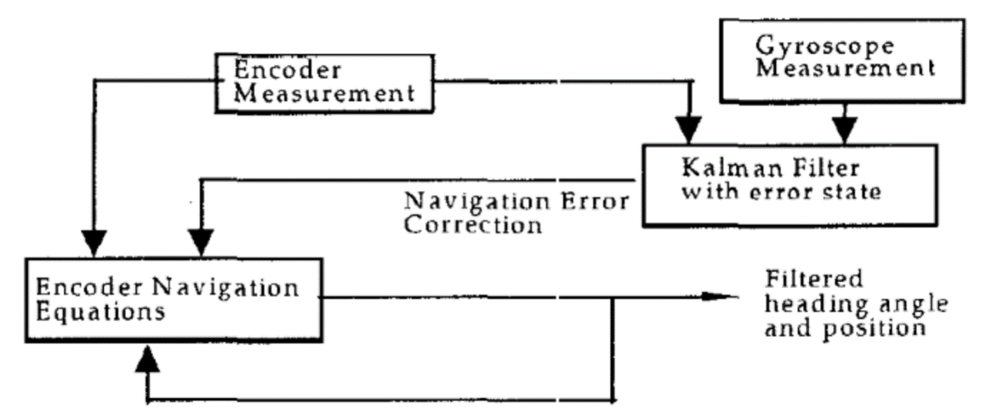
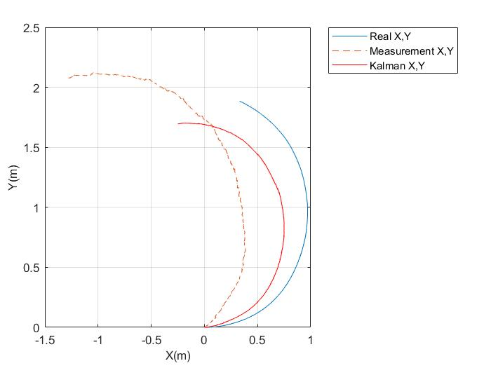

<h1 align="center">
   
</h1>

<h4 align="center">
  
</h4>

## Overview
This project use kalman filter to estimate angel velocity of robot with matlab simulink.
<h1 align="center">
   kalman filter
</h1>

## Code Requirements
* matlab 
* simulink of matlab

## result
<h1 align="center">
   
</h1>

